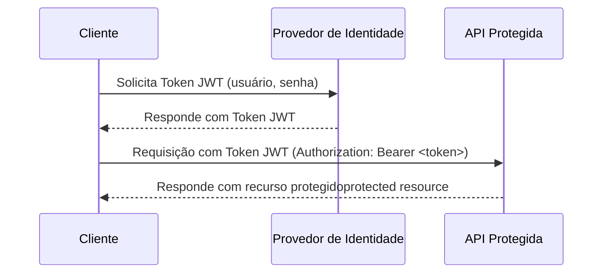

# Mermaid-Copilot
Exemplos de diagramas de Mermaid gerados com auxílio do GitHub Copilot.

## Exemplo de autenticação via JWT

**Dúvida enviada ao Copilot:**

Gere um diagrama de sequência para Mermaid (código) detalhando como seria o fluxo de uma aplicação cliente que consome uma API REST protegida por tokens JWT. O token é obtido a partir de um Identity Provider (Microsoft Entra ID, Keycloak) e, uma vez que a aplicação receba esse token, o mesmo é utilizado para se fazer uma chamada a uma API REST protegida.

